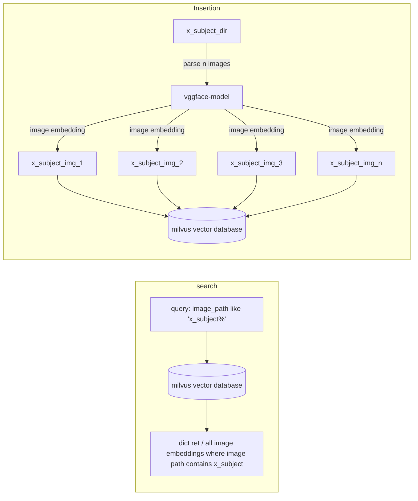

## How to run poc?
steps

1. first you need to run milvus server. https://milvus.io/docs/install_standalone-docker.md
```bash
bash standalone_embed.sh start
```

2. After service is up. insert mock data.
```bash
./insert_vec_db.py
```

3. search data from vector database.
```bash
./get_vecdata.py
```

## Architecture



