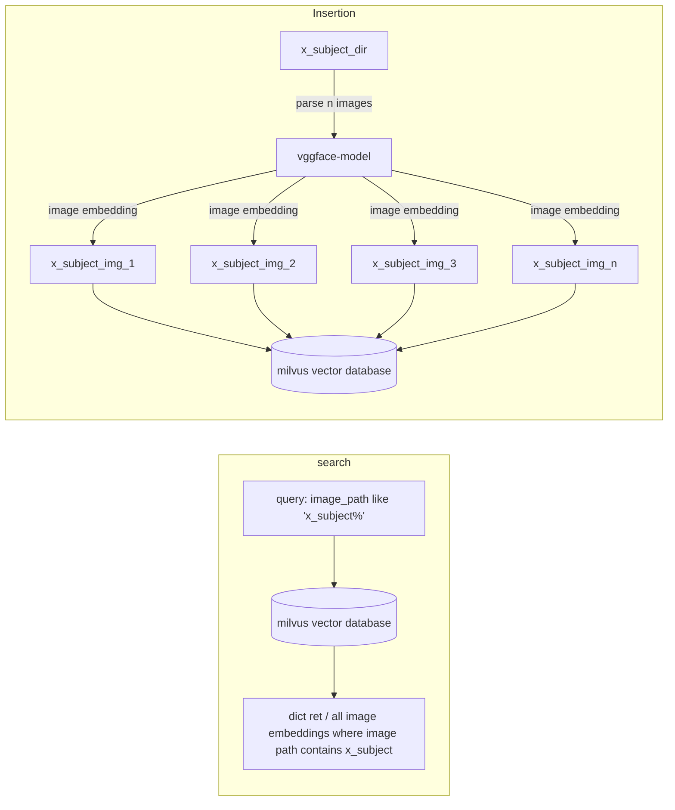

## Architecture

## How to run poc?
steps

1. first you need to run [milvus server](https://milvus.io/docs/install_standalone-docker.md) `bash standalone_embed.sh start`
2. After service is up. insert mock data. `./insert_vec_db.py`
3. search data from vector database. `./get_vecdata.py`

## How to get feature vectors from milvus volume dir from someone else PC?
prerequisite: docker / docker-compose
 
steps
 
1. First you need to download volume folder from the PC you want to get feature's from.
2. unzip it in your host machine.
3. `mkdir milvus-transfer-test`
4. wget https://raw.githubusercontent.com/milvus-io/milvus/master/scripts/standalone_embed.sh
5. move volume.zip to  `milvus-transfer-test`
6. NOTE: make sure standalone_embed.sh script and volume folder are in the same directory.
7. `bash standalone_embed.sh  start`
8. `pip3 install pymilvus`
9. `python3 transfer_test.py`